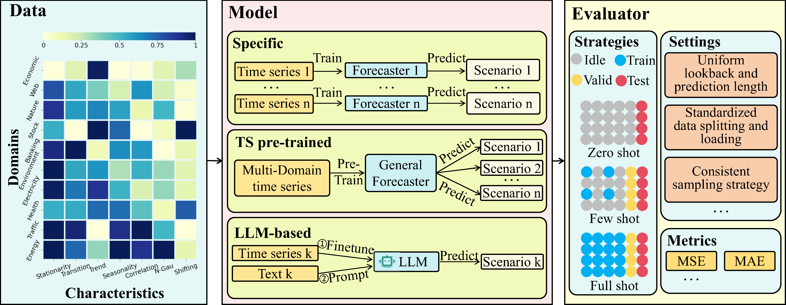

# FM4TS-Bench: COMPREHENSIVE AND UNIFIED BENCHMARKING OF FOUNDATION MODELS FOR TIME SERIES FORECASTING

## Introduction

FM4TS-Bench is a new benchmark designed to enable thorough and fair evaluation and comparison of foundation models, including those based on large language models and time series pretraining. It supports various forecasting strategies, such as zero-shot, few-shot, and full-shot learning. Additionally, FM4TS-Bench provides a standardized pipeline for evaluation processes like dataset splitting, loading, normalization, and few-shot sampling, ensuring consistent and fair assessments across models.

<div align="center">

</div>

## Quickstart

### Installation

1. Clone repository:
    ```shell
    git clone https://github.com/lizhez/FM4TS-Bench.git
    cd FM4TS-Bench
    ```

2. Create virtual environment
    ```shell
    conda create -n "FM4TS-Bench" python=3.10
    conda activate FM4TS-Bench
    pip install -r requirements.txt
    ```

### Prepaer Datasets

You can obtained the well pre-processed datasets from [Google Drive](). Create a separate folder named `./dataset` 

### Prepaer Checkpoints for Foundation Models
1. We provide checkpoints for the basic model used in the paper. Please download the checkpoints from [Google Drive]().

2. You can also download the latest checkpoints from the following link (Please place the checkpoints of GPT-2 in directory ./ts_benchmark/baselines/LLM/checkpoints/, and the checkpoints of the other models in directory ./ts_benchmark/baselines/pre_train/checkpoints/.):

    | **Model** | **Link** |
    | --- | --- |
    | `Chronos` | [Huggingface](https://huggingface.co/amazon/chronos-bolt-base) |
    | `TimesFM` | [Huggingface](https://huggingface.co/google/timesfm-1.0-200m-pytorch) |
    | `Timer` | [Google Drive](https://drive.google.com/drive/folders/15oaiAl4OO5gFqZMJD2lOtX2fxHbpgcU8) |
    | `UniTS` | [Github](https://github.com/mims-harvard/UniTS/releases/tag/ckpt) |
    | `TinyTimeMixer` | [Huggingface](https://huggingface.co/ibm-research/ttm-research-r2) |
    | `Moment` | [Huggingface](https://huggingface.co/AutonLab/MOMENT-1-large) |
    | `MOIRAI` | [Huggingface](https://huggingface.co/Salesforce/moirai-1.0-R-base) |
    | `GPT-2` | [Huggingface](https://huggingface.co/openai-community/gpt2) |

3. Some model-specific requirements
When you want to test the CALF, please refer to the [link](ts_benchmark/baselines/LLM/submodules/CALF/get_woken.ipynb).
When you want to test the AutoTimes, please refer to the [link](ts_benchmark/baselines/LLM/submodules/AutoTimes/preprocess.ipynb).

### Train and evaluate model
- We provide the experiment scripts for all models under the folder `./scripts`. For example you can reproduce a experiment result as the following:

    ```shell
    # Zero-Shot
    sh ./scripts/pre_train_model/zero_shot/ETTh1_scripts/TTM.sh
    ```

- When you want to write your own script, please pay attention to changing the following values to meet different testing requirements: `is_train`, `sampling_rate`, `sampling_basis`, `sampling_strategy`.

    ```shell
    # "is_train" = 1, 0
    # "sampling_rate" = 0.05 (0~1)
    # "sampling_basis" = "sample", "data"
    # "sampling_strategy = "uniform", "random", "begin", "end"
    python ./scripts/run.py --config-path "rolling_forecast_config.json" --data-name-list "ETTh1.csv" --strategy-args '{"horizon":96}' --model-name "pre_train.UniTS" --model-hyper-params '{"horizon": 96, "seq_len": 512, "target_dim": 7, "dataset": "etth1", "is_train": 1, "freq": "h", "sampling_rate": 0.05, "sampling_strategy": "uniform", "sampling_basis": "sample"}' --adapter "PreTrain_adapter"  --gpus 0  --num-workers 1  --timeout 60000  --save-path "TEST"
    ```